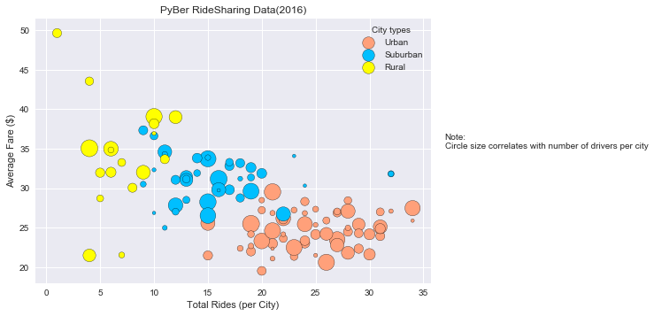

# Pyber Ride Sharing


1. Pyber is most popular among drivers and riders in Urban cities, followed by Suburban.
2. Pyber is comparitively cheaper in Urban regions.
3. Number of drivers is correlated to number of rides in the city.


```python
import os
import pandas as pd
import numpy as np
import matplotlib
import matplotlib.pyplot as plt

plt.style.use("seaborn")
```


```python
city_filename = os.path.join('raw_data','city_data.csv')
ride_filename = os.path.join('raw_data','ride_data.csv')
```


```python
city_df = pd.read_csv(city_filename)
ride_df = pd.read_csv(ride_filename)
rideshares_df = ride_df.merge(city_df,on="city")

rideshares_df['date'] = pd.to_datetime(rideshares_df['date'])

```

# City Summary 


```python
city_group = rideshares_df.groupby(["city","driver_count","type"])

city_summary = pd.DataFrame()
city_summary["Total Rides (per City)"] = city_group["ride_id"].count()
city_summary["Average Fare ($)"] = city_group["fare"].mean()
city_summary["Total Fare ($)"] = city_group["fare"].sum()
city_summary = city_summary.reset_index()


city_summary.head()
```


<div>
<style>
    .dataframe thead tr:only-child th {
        text-align: right;
    }

    .dataframe thead th {
        text-align: left;
    }

    .dataframe tbody tr th {
        vertical-align: top;
    }
</style>
<table border="1" class="dataframe">
  <thead>
    <tr style="text-align: right;">
      <th></th>
      <th>city</th>
      <th>driver_count</th>
      <th>type</th>
      <th>Total Rides (per City)</th>
      <th>Average Fare ($)</th>
      <th>Total Fare ($)</th>
    </tr>
  </thead>
  <tbody>
    <tr>
      <th>0</th>
      <td>Alvarezhaven</td>
      <td>21</td>
      <td>Urban</td>
      <td>31</td>
      <td>23.928710</td>
      <td>741.79</td>
    </tr>
    <tr>
      <th>1</th>
      <td>Alyssaberg</td>
      <td>67</td>
      <td>Urban</td>
      <td>26</td>
      <td>20.609615</td>
      <td>535.85</td>
    </tr>
    <tr>
      <th>2</th>
      <td>Anitamouth</td>
      <td>16</td>
      <td>Suburban</td>
      <td>9</td>
      <td>37.315556</td>
      <td>335.84</td>
    </tr>
    <tr>
      <th>3</th>
      <td>Antoniomouth</td>
      <td>21</td>
      <td>Urban</td>
      <td>22</td>
      <td>23.625000</td>
      <td>519.75</td>
    </tr>
    <tr>
      <th>4</th>
      <td>Aprilchester</td>
      <td>49</td>
      <td>Urban</td>
      <td>19</td>
      <td>21.981579</td>
      <td>417.65</td>
    </tr>
  </tbody>
</table>
</div>


# Bubble Plot Of Ride Sharing Data


```python
colors = {"Urban":"lightsalmon","Suburban":"deepskyblue","Rural":"yellow"}

scatter_plot_df = city_summary[["Total Rides (per City)","Average Fare ($)","type"]]

urban_set = city_summary[city_summary.type == "Urban"]
suburb_set = city_summary[city_summary.type == "Suburban"]
rural_set = city_summary[city_summary.type == "Rural"]
handles = []


ax = urban_set.plot(kind="scatter",
                   x="Total Rides (per City)",y="Average Fare ($)",
                   edgecolor='k',
                   s=city_summary.driver_count*5,
                   color="lightsalmon",
                   label="Urban")
suburb_set.plot(kind="scatter",
               x="Total Rides (per City)",y="Average Fare ($)",
               edgecolor='k',
               s=city_summary.driver_count*5,
               color="deepskyblue",
               label="Suburban",
               ax=ax)
rural_set.plot(kind="scatter",x="Total Rides (per City)",y="Average Fare ($)",
               edgecolor='k',
               s=city_summary.driver_count*5,
               color="yellow",
               label="Rural",
               ax=ax)

plt.legend(title="City types")

plt.xlabel("Total Rides (per City)")

plt.ylabel("Average Fare ($)")

plt.title("PyBer RideSharing Data(2016)")

plt.text(37,35,"Note:\nCircle size correlates with number of drivers per city")
```


    <matplotlib.text.Text at 0x25074e1be80>


```python
plt.show()
```





```python
city_type_group = city_summary.groupby("type")

city_type_summary = pd.DataFrame()

city_type_summary["Total Rides"] = city_type_group["Total Rides (per City)"].sum()
city_type_summary["Total Drivers"] = city_type_group["driver_count"].sum()
city_type_summary["Total Fare ($)"] = city_type_group["Total Fare ($)"].sum()
city_type_summary.reset_index(inplace=True)
city_type_summary.head()
```


<div>
<style>
    .dataframe thead tr:only-child th {
        text-align: right;
    }

    .dataframe thead th {
        text-align: left;
    }

    .dataframe tbody tr th {
        vertical-align: top;
    }
</style>
<table border="1" class="dataframe">
  <thead>
    <tr style="text-align: right;">
      <th></th>
      <th>type</th>
      <th>Total Rides</th>
      <th>Total Drivers</th>
      <th>Total Fare ($)</th>
    </tr>
  </thead>
  <tbody>
    <tr>
      <th>0</th>
      <td>Rural</td>
      <td>125</td>
      <td>104</td>
      <td>4255.09</td>
    </tr>
    <tr>
      <th>1</th>
      <td>Suburban</td>
      <td>657</td>
      <td>638</td>
      <td>20335.69</td>
    </tr>
    <tr>
      <th>2</th>
      <td>Urban</td>
      <td>1625</td>
      <td>2607</td>
      <td>40078.34</td>
    </tr>
  </tbody>
</table>
</div>


# Rides by City Type


```python
explode_dict = {"Urban":0.1,"Suburban":0,"Rural":0}
city_type_summary["explode"] = [explode_dict[x] for x in city_type_summary["type"]]
city_type_summary["colors"] = [colors[x] for x in city_type_summary["type"]]

city_type_summary.plot(kind="pie",y="Total Rides", autopct='%1.1f%%',
 startangle=140, shadow=False,explode=city_type_summary.explode,
                       colors=city_type_summary.colors,labels=city_type_summary.type,
                      wedgeprops = { 'linewidth' : 1 , 'edgecolor' : 'lightgrey'})

plt.axis('off')
plt.axis('equal')

plt.title('% of Total Rides by City Type')

plt.show()
```


# Drivers by City Type


```python
city_type_summary.plot(kind="pie",y="Total Drivers", autopct='%1.1f%%',
 startangle=140, shadow=False,explode=city_type_summary.explode,
                       colors=city_type_summary.colors,labels=city_type_summary.type,
                      wedgeprops = { 'linewidth' : 1 , 'edgecolor' : 'lightgrey'})

plt.axis('off')
plt.axis('equal')

plt.title('% of Total Drivers by City Type')

plt.show()
```


# Fare by City Type


```python
city_type_summary.plot(kind="pie",y="Total Fare ($)", autopct='%1.1f%%',
 startangle=140, shadow=False,explode=city_type_summary.explode,
                       colors=city_type_summary.colors,labels=city_type_summary.type,
                      wedgeprops = { 'linewidth' : 1 , 'edgecolor' : 'lightgrey'})

plt.axis('off')
plt.axis('equal')

plt.title('% of Total Fare ($) by City Type')

plt.show()
```


```python
city_summary.sort_values(['Average Fare ($)'],ascending=[False])
```


<div>
<style>
    .dataframe thead tr:only-child th {
        text-align: right;
    }

    .dataframe thead th {
        text-align: left;
    }

    .dataframe tbody tr th {
        vertical-align: top;
    }
</style>
<table border="1" class="dataframe">
  <thead>
    <tr style="text-align: right;">
      <th></th>
      <th>city</th>
      <th>driver_count</th>
      <th>type</th>
      <th>Total Rides (per City)</th>
      <th>Average Fare ($)</th>
      <th>Total Fare ($)</th>
    </tr>
  </thead>
  <tbody>
    <tr>
      <th>45</th>
      <td>Manuelchester</td>
      <td>7</td>
      <td>Rural</td>
      <td>1</td>
      <td>49.620000</td>
      <td>49.62</td>
    </tr>
    <tr>
      <th>48</th>
      <td>Matthewside</td>
      <td>4</td>
      <td>Rural</td>
      <td>4</td>
      <td>43.532500</td>
      <td>174.13</td>
    </tr>
    <tr>
      <th>18</th>
      <td>East Stephen</td>
      <td>6</td>
      <td>Rural</td>
      <td>10</td>
      <td>39.053000</td>
      <td>390.53</td>
    </tr>
    <tr>
      <th>93</th>
      <td>South Joseph</td>
      <td>3</td>
      <td>Rural</td>
      <td>12</td>
      <td>38.983333</td>
      <td>467.80</td>
    </tr>
    <tr>
      <th>66</th>
      <td>North Whitney</td>
      <td>10</td>
      <td>Rural</td>
      <td>10</td>
      <td>38.146000</td>
      <td>381.46</td>
    </tr>
    <tr>
      <th>2</th>
      <td>Anitamouth</td>
      <td>16</td>
      <td>Suburban</td>
      <td>9</td>
      <td>37.315556</td>
      <td>335.84</td>
    </tr>
    <tr>
      <th>34</th>
      <td>Kennethburgh</td>
      <td>3</td>
      <td>Rural</td>
      <td>10</td>
      <td>36.928000</td>
      <td>369.28</td>
    </tr>
    <tr>
      <th>7</th>
      <td>Carrollbury</td>
      <td>4</td>
      <td>Suburban</td>
      <td>10</td>
      <td>36.606000</td>
      <td>366.06</td>
    </tr>
    <tr>
      <th>58</th>
      <td>New Johnbury</td>
      <td>6</td>
      <td>Rural</td>
      <td>4</td>
      <td>35.042500</td>
      <td>140.17</td>
    </tr>
    <tr>
      <th>36</th>
      <td>Kinghaven</td>
      <td>3</td>
      <td>Rural</td>
      <td>6</td>
      <td>34.980000</td>
      <td>209.88</td>
    </tr>
    <tr>
      <th>87</th>
      <td>Shelbyhaven</td>
      <td>9</td>
      <td>Rural</td>
      <td>6</td>
      <td>34.828333</td>
      <td>208.97</td>
    </tr>
    <tr>
      <th>10</th>
      <td>Conwaymouth</td>
      <td>18</td>
      <td>Suburban</td>
      <td>11</td>
      <td>34.591818</td>
      <td>380.51</td>
    </tr>
    <tr>
      <th>121</th>
      <td>Williamchester</td>
      <td>26</td>
      <td>Suburban</td>
      <td>11</td>
      <td>34.278182</td>
      <td>377.06</td>
    </tr>
    <tr>
      <th>62</th>
      <td>New Samanthaside</td>
      <td>16</td>
      <td>Suburban</td>
      <td>23</td>
      <td>34.069130</td>
      <td>783.59</td>
    </tr>
    <tr>
      <th>86</th>
      <td>Sarahview</td>
      <td>18</td>
      <td>Suburban</td>
      <td>15</td>
      <td>33.862000</td>
      <td>507.93</td>
    </tr>
    <tr>
      <th>116</th>
      <td>West Pamelaborough</td>
      <td>27</td>
      <td>Suburban</td>
      <td>14</td>
      <td>33.799286</td>
      <td>473.19</td>
    </tr>
    <tr>
      <th>6</th>
      <td>Campbellport</td>
      <td>26</td>
      <td>Suburban</td>
      <td>15</td>
      <td>33.711333</td>
      <td>505.67</td>
    </tr>
    <tr>
      <th>17</th>
      <td>East Leslie</td>
      <td>9</td>
      <td>Rural</td>
      <td>11</td>
      <td>33.660909</td>
      <td>370.27</td>
    </tr>
    <tr>
      <th>117</th>
      <td>West Paulport</td>
      <td>5</td>
      <td>Suburban</td>
      <td>17</td>
      <td>33.278235</td>
      <td>565.73</td>
    </tr>
    <tr>
      <th>19</th>
      <td>East Troybury</td>
      <td>3</td>
      <td>Rural</td>
      <td>7</td>
      <td>33.244286</td>
      <td>232.71</td>
    </tr>
    <tr>
      <th>30</th>
      <td>Jeffreyton</td>
      <td>8</td>
      <td>Suburban</td>
      <td>18</td>
      <td>33.165556</td>
      <td>596.98</td>
    </tr>
    <tr>
      <th>57</th>
      <td>New Jessicamouth</td>
      <td>22</td>
      <td>Suburban</td>
      <td>17</td>
      <td>32.810588</td>
      <td>557.78</td>
    </tr>
    <tr>
      <th>16</th>
      <td>East Jenniferchester</td>
      <td>22</td>
      <td>Suburban</td>
      <td>19</td>
      <td>32.599474</td>
      <td>619.39</td>
    </tr>
    <tr>
      <th>64</th>
      <td>North Tara</td>
      <td>14</td>
      <td>Suburban</td>
      <td>9</td>
      <td>32.386667</td>
      <td>291.48</td>
    </tr>
    <tr>
      <th>23</th>
      <td>Floresberg</td>
      <td>7</td>
      <td>Suburban</td>
      <td>10</td>
      <td>32.310000</td>
      <td>323.10</td>
    </tr>
    <tr>
      <th>27</th>
      <td>Jacksonfort</td>
      <td>6</td>
      <td>Rural</td>
      <td>6</td>
      <td>32.006667</td>
      <td>192.04</td>
    </tr>
    <tr>
      <th>25</th>
      <td>Hernandezshire</td>
      <td>10</td>
      <td>Rural</td>
      <td>9</td>
      <td>32.002222</td>
      <td>288.02</td>
    </tr>
    <tr>
      <th>99</th>
      <td>Stevensport</td>
      <td>6</td>
      <td>Rural</td>
      <td>5</td>
      <td>31.948000</td>
      <td>159.74</td>
    </tr>
    <tr>
      <th>52</th>
      <td>New Brandonborough</td>
      <td>9</td>
      <td>Suburban</td>
      <td>14</td>
      <td>31.902857</td>
      <td>446.64</td>
    </tr>
    <tr>
      <th>82</th>
      <td>Rodriguezview</td>
      <td>10</td>
      <td>Suburban</td>
      <td>20</td>
      <td>31.866500</td>
      <td>637.33</td>
    </tr>
    <tr>
      <th>...</th>
      <td>...</td>
      <td>...</td>
      <td>...</td>
      <td>...</td>
      <td>...</td>
      <td>...</td>
    </tr>
    <tr>
      <th>109</th>
      <td>West Brandy</td>
      <td>12</td>
      <td>Urban</td>
      <td>30</td>
      <td>24.157667</td>
      <td>724.73</td>
    </tr>
    <tr>
      <th>56</th>
      <td>New Jeffrey</td>
      <td>58</td>
      <td>Urban</td>
      <td>25</td>
      <td>24.130000</td>
      <td>603.25</td>
    </tr>
    <tr>
      <th>0</th>
      <td>Alvarezhaven</td>
      <td>21</td>
      <td>Urban</td>
      <td>31</td>
      <td>23.928710</td>
      <td>741.79</td>
    </tr>
    <tr>
      <th>98</th>
      <td>Spencertown</td>
      <td>68</td>
      <td>Urban</td>
      <td>26</td>
      <td>23.681154</td>
      <td>615.71</td>
    </tr>
    <tr>
      <th>3</th>
      <td>Antoniomouth</td>
      <td>21</td>
      <td>Urban</td>
      <td>22</td>
      <td>23.625000</td>
      <td>519.75</td>
    </tr>
    <tr>
      <th>85</th>
      <td>Sarabury</td>
      <td>46</td>
      <td>Urban</td>
      <td>27</td>
      <td>23.490000</td>
      <td>634.23</td>
    </tr>
    <tr>
      <th>80</th>
      <td>Prattfurt</td>
      <td>43</td>
      <td>Urban</td>
      <td>24</td>
      <td>23.346667</td>
      <td>560.32</td>
    </tr>
    <tr>
      <th>69</th>
      <td>Pearsonberg</td>
      <td>43</td>
      <td>Urban</td>
      <td>20</td>
      <td>23.307500</td>
      <td>466.15</td>
    </tr>
    <tr>
      <th>84</th>
      <td>Sandymouth</td>
      <td>11</td>
      <td>Urban</td>
      <td>27</td>
      <td>23.105926</td>
      <td>623.86</td>
    </tr>
    <tr>
      <th>24</th>
      <td>Fosterside</td>
      <td>69</td>
      <td>Urban</td>
      <td>24</td>
      <td>23.034583</td>
      <td>552.83</td>
    </tr>
    <tr>
      <th>11</th>
      <td>Davidtown</td>
      <td>73</td>
      <td>Urban</td>
      <td>21</td>
      <td>22.978095</td>
      <td>482.54</td>
    </tr>
    <tr>
      <th>35</th>
      <td>Kimberlychester</td>
      <td>13</td>
      <td>Urban</td>
      <td>27</td>
      <td>22.947037</td>
      <td>619.57</td>
    </tr>
    <tr>
      <th>88</th>
      <td>Smithhaven</td>
      <td>67</td>
      <td>Urban</td>
      <td>27</td>
      <td>22.788889</td>
      <td>615.30</td>
    </tr>
    <tr>
      <th>123</th>
      <td>Wiseborough</td>
      <td>55</td>
      <td>Urban</td>
      <td>19</td>
      <td>22.676842</td>
      <td>430.86</td>
    </tr>
    <tr>
      <th>83</th>
      <td>Russellport</td>
      <td>9</td>
      <td>Urban</td>
      <td>23</td>
      <td>22.486087</td>
      <td>517.18</td>
    </tr>
    <tr>
      <th>119</th>
      <td>West Sydneyhaven</td>
      <td>70</td>
      <td>Urban</td>
      <td>18</td>
      <td>22.368333</td>
      <td>402.63</td>
    </tr>
    <tr>
      <th>111</th>
      <td>West Dawnfurt</td>
      <td>34</td>
      <td>Urban</td>
      <td>29</td>
      <td>22.330345</td>
      <td>647.58</td>
    </tr>
    <tr>
      <th>77</th>
      <td>Port Martinberg</td>
      <td>44</td>
      <td>Urban</td>
      <td>21</td>
      <td>22.329524</td>
      <td>468.92</td>
    </tr>
    <tr>
      <th>43</th>
      <td>Lisatown</td>
      <td>47</td>
      <td>Urban</td>
      <td>23</td>
      <td>22.225217</td>
      <td>511.18</td>
    </tr>
    <tr>
      <th>4</th>
      <td>Aprilchester</td>
      <td>49</td>
      <td>Urban</td>
      <td>19</td>
      <td>21.981579</td>
      <td>417.65</td>
    </tr>
    <tr>
      <th>33</th>
      <td>Kelseyland</td>
      <td>63</td>
      <td>Urban</td>
      <td>28</td>
      <td>21.806429</td>
      <td>610.58</td>
    </tr>
    <tr>
      <th>100</th>
      <td>Stewartview</td>
      <td>49</td>
      <td>Urban</td>
      <td>30</td>
      <td>21.614000</td>
      <td>648.42</td>
    </tr>
    <tr>
      <th>114</th>
      <td>West Kevintown</td>
      <td>5</td>
      <td>Rural</td>
      <td>7</td>
      <td>21.528571</td>
      <td>150.70</td>
    </tr>
    <tr>
      <th>12</th>
      <td>Davistown</td>
      <td>25</td>
      <td>Urban</td>
      <td>25</td>
      <td>21.497200</td>
      <td>537.43</td>
    </tr>
    <tr>
      <th>26</th>
      <td>Horneland</td>
      <td>8</td>
      <td>Rural</td>
      <td>4</td>
      <td>21.482500</td>
      <td>85.93</td>
    </tr>
    <tr>
      <th>106</th>
      <td>Vickimouth</td>
      <td>13</td>
      <td>Urban</td>
      <td>15</td>
      <td>21.474667</td>
      <td>322.12</td>
    </tr>
    <tr>
      <th>81</th>
      <td>Rodriguezburgh</td>
      <td>52</td>
      <td>Urban</td>
      <td>23</td>
      <td>21.332609</td>
      <td>490.65</td>
    </tr>
    <tr>
      <th>113</th>
      <td>West Jefferyfurt</td>
      <td>65</td>
      <td>Urban</td>
      <td>21</td>
      <td>21.072857</td>
      <td>442.53</td>
    </tr>
    <tr>
      <th>1</th>
      <td>Alyssaberg</td>
      <td>67</td>
      <td>Urban</td>
      <td>26</td>
      <td>20.609615</td>
      <td>535.85</td>
    </tr>
    <tr>
      <th>108</th>
      <td>West Alexis</td>
      <td>47</td>
      <td>Urban</td>
      <td>20</td>
      <td>19.523000</td>
      <td>390.46</td>
    </tr>
  </tbody>
</table>
<p>126 rows × 6 columns</p>
</div>


